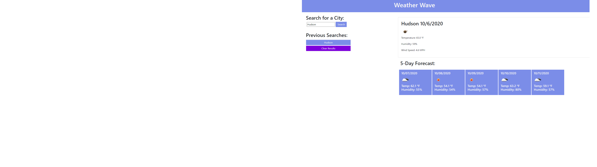

# Weather-Wave
Learn the wonderful and inspiring information that is the Weather

Git Repo: https://github.com/PrLamkin/Weather-Wave
Deployed Product: https://prlamkin.github.io/Weather-Wave/

Boring bland usage instructions

Step 1: Go to the Site

Step 2: put in your desire city

Step 3: Profit

N/A installation

I would like to thank Arnold Palmer for without him, I never would've remembered that I had to do this still and been able to do it in 5 hours.